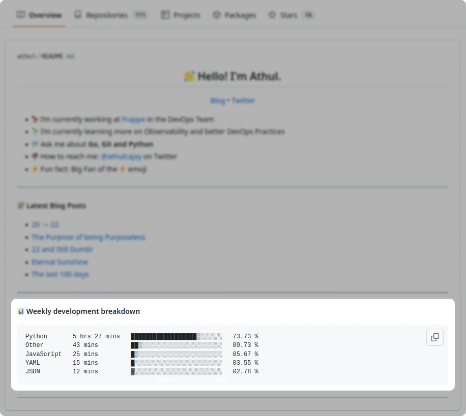

<p align="center">
 
 <h3 align="center">Github 常用徽章合集</h3>
 <p align="center">Github Badge Collection</p>
</p>

## 说明

本 README 主要收集一些零散的 Github 常用徽章和活动图等。

DOI 号、标识图标、Emoji 和 Github 的 Markdown 技巧等都在单独的文件中，下面是一个简单指引：

+ [Github 生成 DOI 徽章](DOI.md)
+ [Github 一些可用的标识](GIF.md)
+ [Github 支持的 Emoji](Emoji.md)
+ [Github 的 Markdown 用法](Markdown.md)

<br><br>

<p align="center">
 <h3 align="center"> Ⅰ. 徽章类 </h3>
</p>


### 1. [Shields 徽章](https://shields.io/)

Shields 适用于各类现有的或自定义名称的徽章。

```
style样式参数，共有5种样式：
style=plastic
style=flat
style=flat-square
style=for-the-badge
style=social

logo来自simple-icons：https://simpleicons.org
logo自定义：https://shields.io/docs/logos

Shields文档：https://shields.io/badges/static-badge
```

#### 1.1 品牌类（静态）

```
https://img.shields.io/badge/左侧文字-右侧文字-颜色?logo=图标

注：
1.图标库支持主流品牌、也可以使用 base64 嵌入自定义图标；
2.图标库查看文档：https://simpleicons.org；
3.图标支持 logoColor 参数设置颜色，但文字不支持设置颜色；
4.空格需要替换为 `%20`；
5.微软和Adobe家族图标被 simple-icons 除名了，现在无法使用。
```
|                           plastic                            |                             flat                             |                         flat-square                          |                        for-the-badge                         |
| :----------------------------------------------------------: | :----------------------------------------------------------: | :----------------------------------------------------------: | :----------------------------------------------------------: |
|  |  |  |  |
|  |  |  |  |
|  |  |  |  |
|  |  |  |  |
|  |  |  |  |
|  |  |  |  |

需要注意的是微软和 Adobe 家族图标被 simple-icons 除名了，会出现如下表所示的标识缺失的问题：


|                           plastic                            |                             flat                             |                         flat-square                          |                        for-the-badge                         |
| :----------------------------------------------------------: | :----------------------------------------------------------: | :----------------------------------------------------------: | :----------------------------------------------------------: |
|  |  |  |  |
|  |  |  |  |
|  |  |  |  |
|  |  |  |  |

#### 1.2 开发类（静态）

```
https://img.shields.io/badge/左侧文字-右侧文字-颜色?logo=图标

注：
1.图标库支持主流品牌、也可以使用 base64 嵌入自定义图标；
2.图标库查看文档：https://simpleicons.org；
3.图标支持 logoColor 参数设置颜色，但文字不支持设置颜色；
4.空格需要替换为 `%20`；
5.微软和Adobe家族图标被 simple-icons 除名了，现在无法使用。
```
|                           plastic                            |                             flat                             |                         flat-square                          |                        for-the-badge                         |
| :----------------------------------------------------------: | :----------------------------------------------------------: | :----------------------------------------------------------: | :----------------------------------------------------------: |
|  |  |  |  |
|  |  |  |  |
|  |  |  |  |
|  |  |  |  |
|  |  |  |  |
|  |  |  |  |
|  |  |  |  |
|  |  |  |  |
|  |  |  |  |
|  |  |  |  |

#### 1.3 社交类（动态更新）

```
https://img.shields.io/twitter/follow/:user
或
https://img.shields.io/badge/左侧文字-右侧文字-颜色?logo=图标&style=social

注：
1.图标库支持主流品牌、也可以使用 base64 嵌入自定义图标；
2.图标库查看文档：https://simpleicons.org；
3.图标支持 logoColor 参数设置颜色，但文字不支持设置颜色；
4.空格需要替换为 `%20`；
5.微软和Adobe家族图标被 simple-icons 除名了，现在无法使用。
```

|                            Views                             |                            Follow                            |
| :----------------------------------------------------------: | :----------------------------------------------------------: |
|     |   |
|  |  |

#### 1.4 自定义类（静态）

```
https://img.shields.io/badge/文字-颜色?logo=data:image/...

注：
1.任何自定义徽标都可以通过 base64 编码在 URL 参数中传递；
2.支持 jpg, png, svg 等格式；
3.使用 base64 编码后 logoColor 参数将会失效。
```
微软和 Adobe 家族图标等，需要自行用 base64 编码定义：


|                           plastic                            |                             flat                             |                         flat-square                          |                        for-the-badge                         |
| :----------------------------------------------------------: | :----------------------------------------------------------: | :----------------------------------------------------------: | :----------------------------------------------------------: |
|  |  |  |  |
| ![](https://img.shields.io/badge/VSCode-0f81c2?style=plastic&logo=data:image/svg+xml;base64,PD94bWwgdmVyc2lvbj0iMS4wIiBzdGFuZGFsb25lPSJubyI/PjwhRE9DVFlQRSBzdmcgUFVCTElDICItLy9XM0MvL0RURCBTVkcgMS4xLy9FTiIgImh0dHA6Ly93d3cudzMub3JnL0dyYXBoaWNzL1NWRy8xLjEvRFREL3N2ZzExLmR0ZCI+PHN2ZyB0PSIxNzI4MTA5NDQzMzg2IiBjbGFzcz0iaWNvbiIgdmlld0JveD0iMCAwIDEwMjQgMTAyNCIgdmVyc2lvbj0iMS4xIiB4bWxucz0iaHR0cDovL3d3dy53My5vcmcvMjAwMC9zdmciIHAtaWQ9IjU5OTAiIHhtbG5zOnhsaW5rPSJodHRwOi8vd3d3LnczLm9yZy8xOTk5L3hsaW5rIiB3aWR0aD0iMjQiIGhlaWdodD0iMjQiPjxwYXRoIGQ9Ik03MjUuMzMzMzMzIDcwMi43MlYzMTUuMzA2NjY3bC0yNTYgMTkzLjcwNjY2Nk05NC43MiAzOTIuMTA2NjY3YTM2LjYwOCAzNi42MDggMCAwIDEtMC44NTMzMzMtNDkuMDY2NjY3bDUxLjItNDcuMzZjOC41MzMzMzMtNy42OCAyOS40NC0xMS4wOTMzMzMgNDQuOCAwbDE0NS45MiAxMTEuMzYgMzM4LjM0NjY2Ni0zMDkuMzMzMzMzYzEzLjY1MzMzMy0xMy42NTMzMzMgMzcuMTItMTkuMiA2NC01LjEybDE3MC42NjY2NjcgODEuNDkzMzMzYzE1LjM2IDguOTYgMjkuODY2NjY3IDIzLjA0IDI5Ljg2NjY2NyA0OS4wNjY2Njd2NTc2YzAgMTcuMDY2NjY3LTEyLjM3MzMzMyAzNS40MTMzMzMtMjUuNiA0Mi42NjY2NjZsLTE4Ny43MzMzMzQgODkuNmMtMTMuNjUzMzMzIDUuNTQ2NjY3LTM5LjI1MzMzMyAwLjQyNjY2Ny00OC4yMTMzMzMtOC41MzMzMzNsLTM0Mi4xODY2NjctMzExLjQ2NjY2Ny0xNDUuMDY2NjY2IDExMC45MzMzMzRjLTE2LjIxMzMzMyAxMS4wOTMzMzMtMzYuMjY2NjY3IDguMTA2NjY3LTQ0LjggMGwtNTEuMi00Ni45MzMzMzRjLTEzLjY1MzMzMy0xNC4wOC0xMS45NDY2NjctMzcuMTIgMi4xMzMzMzMtNTEuMmwxMjgtMTE1LjIiIGZpbGw9IiNmZmZmZmYiIHAtaWQ9IjU5OTEiPjwvcGF0aD48L3N2Zz4=) | ![](https://img.shields.io/badge/VSCode-0f81c2?style=flat&logo=data:image/svg+xml;base64,PD94bWwgdmVyc2lvbj0iMS4wIiBzdGFuZGFsb25lPSJubyI/PjwhRE9DVFlQRSBzdmcgUFVCTElDICItLy9XM0MvL0RURCBTVkcgMS4xLy9FTiIgImh0dHA6Ly93d3cudzMub3JnL0dyYXBoaWNzL1NWRy8xLjEvRFREL3N2ZzExLmR0ZCI+PHN2ZyB0PSIxNzI4MTA5NDQzMzg2IiBjbGFzcz0iaWNvbiIgdmlld0JveD0iMCAwIDEwMjQgMTAyNCIgdmVyc2lvbj0iMS4xIiB4bWxucz0iaHR0cDovL3d3dy53My5vcmcvMjAwMC9zdmciIHAtaWQ9IjU5OTAiIHhtbG5zOnhsaW5rPSJodHRwOi8vd3d3LnczLm9yZy8xOTk5L3hsaW5rIiB3aWR0aD0iMjQiIGhlaWdodD0iMjQiPjxwYXRoIGQ9Ik03MjUuMzMzMzMzIDcwMi43MlYzMTUuMzA2NjY3bC0yNTYgMTkzLjcwNjY2Nk05NC43MiAzOTIuMTA2NjY3YTM2LjYwOCAzNi42MDggMCAwIDEtMC44NTMzMzMtNDkuMDY2NjY3bDUxLjItNDcuMzZjOC41MzMzMzMtNy42OCAyOS40NC0xMS4wOTMzMzMgNDQuOCAwbDE0NS45MiAxMTEuMzYgMzM4LjM0NjY2Ni0zMDkuMzMzMzMzYzEzLjY1MzMzMy0xMy42NTMzMzMgMzcuMTItMTkuMiA2NC01LjEybDE3MC42NjY2NjcgODEuNDkzMzMzYzE1LjM2IDguOTYgMjkuODY2NjY3IDIzLjA0IDI5Ljg2NjY2NyA0OS4wNjY2Njd2NTc2YzAgMTcuMDY2NjY3LTEyLjM3MzMzMyAzNS40MTMzMzMtMjUuNiA0Mi42NjY2NjZsLTE4Ny43MzMzMzQgODkuNmMtMTMuNjUzMzMzIDUuNTQ2NjY3LTM5LjI1MzMzMyAwLjQyNjY2Ny00OC4yMTMzMzMtOC41MzMzMzNsLTM0Mi4xODY2NjctMzExLjQ2NjY2Ny0xNDUuMDY2NjY2IDExMC45MzMzMzRjLTE2LjIxMzMzMyAxMS4wOTMzMzMtMzYuMjY2NjY3IDguMTA2NjY3LTQ0LjggMGwtNTEuMi00Ni45MzMzMzRjLTEzLjY1MzMzMy0xNC4wOC0xMS45NDY2NjctMzcuMTIgMi4xMzMzMzMtNTEuMmwxMjgtMTE1LjIiIGZpbGw9IiNmZmZmZmYiIHAtaWQ9IjU5OTEiPjwvcGF0aD48L3N2Zz4=) | ![](https://img.shields.io/badge/VSCode-0f81c2?style=flat-square&logo=data:image/svg+xml;base64,PD94bWwgdmVyc2lvbj0iMS4wIiBzdGFuZGFsb25lPSJubyI/PjwhRE9DVFlQRSBzdmcgUFVCTElDICItLy9XM0MvL0RURCBTVkcgMS4xLy9FTiIgImh0dHA6Ly93d3cudzMub3JnL0dyYXBoaWNzL1NWRy8xLjEvRFREL3N2ZzExLmR0ZCI+PHN2ZyB0PSIxNzI4MTA5NDQzMzg2IiBjbGFzcz0iaWNvbiIgdmlld0JveD0iMCAwIDEwMjQgMTAyNCIgdmVyc2lvbj0iMS4xIiB4bWxucz0iaHR0cDovL3d3dy53My5vcmcvMjAwMC9zdmciIHAtaWQ9IjU5OTAiIHhtbG5zOnhsaW5rPSJodHRwOi8vd3d3LnczLm9yZy8xOTk5L3hsaW5rIiB3aWR0aD0iMjQiIGhlaWdodD0iMjQiPjxwYXRoIGQ9Ik03MjUuMzMzMzMzIDcwMi43MlYzMTUuMzA2NjY3bC0yNTYgMTkzLjcwNjY2Nk05NC43MiAzOTIuMTA2NjY3YTM2LjYwOCAzNi42MDggMCAwIDEtMC44NTMzMzMtNDkuMDY2NjY3bDUxLjItNDcuMzZjOC41MzMzMzMtNy42OCAyOS40NC0xMS4wOTMzMzMgNDQuOCAwbDE0NS45MiAxMTEuMzYgMzM4LjM0NjY2Ni0zMDkuMzMzMzMzYzEzLjY1MzMzMy0xMy42NTMzMzMgMzcuMTItMTkuMiA2NC01LjEybDE3MC42NjY2NjcgODEuNDkzMzMzYzE1LjM2IDguOTYgMjkuODY2NjY3IDIzLjA0IDI5Ljg2NjY2NyA0OS4wNjY2Njd2NTc2YzAgMTcuMDY2NjY3LTEyLjM3MzMzMyAzNS40MTMzMzMtMjUuNiA0Mi42NjY2NjZsLTE4Ny43MzMzMzQgODkuNmMtMTMuNjUzMzMzIDUuNTQ2NjY3LTM5LjI1MzMzMyAwLjQyNjY2Ny00OC4yMTMzMzMtOC41MzMzMzNsLTM0Mi4xODY2NjctMzExLjQ2NjY2Ny0xNDUuMDY2NjY2IDExMC45MzMzMzRjLTE2LjIxMzMzMyAxMS4wOTMzMzMtMzYuMjY2NjY3IDguMTA2NjY3LTQ0LjggMGwtNTEuMi00Ni45MzMzMzRjLTEzLjY1MzMzMy0xNC4wOC0xMS45NDY2NjctMzcuMTIgMi4xMzMzMzMtNTEuMmwxMjgtMTE1LjIiIGZpbGw9IiNmZmZmZmYiIHAtaWQ9IjU5OTEiPjwvcGF0aD48L3N2Zz4=) | ![](https://img.shields.io/badge/VSCode-0f81c2?style=for-the-badge&logo=data:image/svg+xml;base64,PD94bWwgdmVyc2lvbj0iMS4wIiBzdGFuZGFsb25lPSJubyI/PjwhRE9DVFlQRSBzdmcgUFVCTElDICItLy9XM0MvL0RURCBTVkcgMS4xLy9FTiIgImh0dHA6Ly93d3cudzMub3JnL0dyYXBoaWNzL1NWRy8xLjEvRFREL3N2ZzExLmR0ZCI+PHN2ZyB0PSIxNzI4MTA5NDQzMzg2IiBjbGFzcz0iaWNvbiIgdmlld0JveD0iMCAwIDEwMjQgMTAyNCIgdmVyc2lvbj0iMS4xIiB4bWxucz0iaHR0cDovL3d3dy53My5vcmcvMjAwMC9zdmciIHAtaWQ9IjU5OTAiIHhtbG5zOnhsaW5rPSJodHRwOi8vd3d3LnczLm9yZy8xOTk5L3hsaW5rIiB3aWR0aD0iMjQiIGhlaWdodD0iMjQiPjxwYXRoIGQ9Ik03MjUuMzMzMzMzIDcwMi43MlYzMTUuMzA2NjY3bC0yNTYgMTkzLjcwNjY2Nk05NC43MiAzOTIuMTA2NjY3YTM2LjYwOCAzNi42MDggMCAwIDEtMC44NTMzMzMtNDkuMDY2NjY3bDUxLjItNDcuMzZjOC41MzMzMzMtNy42OCAyOS40NC0xMS4wOTMzMzMgNDQuOCAwbDE0NS45MiAxMTEuMzYgMzM4LjM0NjY2Ni0zMDkuMzMzMzMzYzEzLjY1MzMzMy0xMy42NTMzMzMgMzcuMTItMTkuMiA2NC01LjEybDE3MC42NjY2NjcgODEuNDkzMzMzYzE1LjM2IDguOTYgMjkuODY2NjY3IDIzLjA0IDI5Ljg2NjY2NyA0OS4wNjY2Njd2NTc2YzAgMTcuMDY2NjY3LTEyLjM3MzMzMyAzNS40MTMzMzMtMjUuNiA0Mi42NjY2NjZsLTE4Ny43MzMzMzQgODkuNmMtMTMuNjUzMzMzIDUuNTQ2NjY3LTM5LjI1MzMzMyAwLjQyNjY2Ny00OC4yMTMzMzMtOC41MzMzMzNsLTM0Mi4xODY2NjctMzExLjQ2NjY2Ny0xNDUuMDY2NjY2IDExMC45MzMzMzRjLTE2LjIxMzMzMyAxMS4wOTMzMzMtMzYuMjY2NjY3IDguMTA2NjY3LTQ0LjggMGwtNTEuMi00Ni45MzMzMzRjLTEzLjY1MzMzMy0xNC4wOC0xMS45NDY2NjctMzcuMTIgMi4xMzMzMzMtNTEuMmwxMjgtMTE1LjIiIGZpbGw9IiNmZmZmZmYiIHAtaWQ9IjU5OTEiPjwvcGF0aD48L3N2Zz4=) |
|  |  |  |  |
|  |  |  |  |
|  |  |  |  |
| ![](https://img.shields.io/badge/IDE-Visual%20Studio%20Code-blue?style=**plastic**&logo=data:image/svg+xml;base64,PD94bWwgdmVyc2lvbj0iMS4wIiBzdGFuZGFsb25lPSJubyI/PjwhRE9DVFlQRSBzdmcgUFVCTElDICItLy9XM0MvL0RURCBTVkcgMS4xLy9FTiIgImh0dHA6Ly93d3cudzMub3JnL0dyYXBoaWNzL1NWRy8xLjEvRFREL3N2ZzExLmR0ZCI+PHN2ZyB0PSIxNzI4MTA5NDQzMzg2IiBjbGFzcz0iaWNvbiIgdmlld0JveD0iMCAwIDEwMjQgMTAyNCIgdmVyc2lvbj0iMS4xIiB4bWxucz0iaHR0cDovL3d3dy53My5vcmcvMjAwMC9zdmciIHAtaWQ9IjU5OTAiIHhtbG5zOnhsaW5rPSJodHRwOi8vd3d3LnczLm9yZy8xOTk5L3hsaW5rIiB3aWR0aD0iMjQiIGhlaWdodD0iMjQiPjxwYXRoIGQ9Ik03MjUuMzMzMzMzIDcwMi43MlYzMTUuMzA2NjY3bC0yNTYgMTkzLjcwNjY2Nk05NC43MiAzOTIuMTA2NjY3YTM2LjYwOCAzNi42MDggMCAwIDEtMC44NTMzMzMtNDkuMDY2NjY3bDUxLjItNDcuMzZjOC41MzMzMzMtNy42OCAyOS40NC0xMS4wOTMzMzMgNDQuOCAwbDE0NS45MiAxMTEuMzYgMzM4LjM0NjY2Ni0zMDkuMzMzMzMzYzEzLjY1MzMzMy0xMy42NTMzMzMgMzcuMTItMTkuMiA2NC01LjEybDE3MC42NjY2NjcgODEuNDkzMzMzYzE1LjM2IDguOTYgMjkuODY2NjY3IDIzLjA0IDI5Ljg2NjY2NyA0OS4wNjY2Njd2NTc2YzAgMTcuMDY2NjY3LTEyLjM3MzMzMyAzNS40MTMzMzMtMjUuNiA0Mi42NjY2NjZsLTE4Ny43MzMzMzQgODkuNmMtMTMuNjUzMzMzIDUuNTQ2NjY3LTM5LjI1MzMzMyAwLjQyNjY2Ny00OC4yMTMzMzMtOC41MzMzMzNsLTM0Mi4xODY2NjctMzExLjQ2NjY2Ny0xNDUuMDY2NjY2IDExMC45MzMzMzRjLTE2LjIxMzMzMyAxMS4wOTMzMzMtMzYuMjY2NjY3IDguMTA2NjY3LTQ0LjggMGwtNTEuMi00Ni45MzMzMzRjLTEzLjY1MzMzMy0xNC4wOC0xMS45NDY2NjctMzcuMTIgMi4xMzMzMzMtNTEuMmwxMjgtMTE1LjIiIGZpbGw9IiNmZmZmZmYiIHAtaWQ9IjU5OTEiPjwvcGF0aD48L3N2Zz4=) | ![](https://img.shields.io/badge/IDE-Visual%20Studio%20Code-blue?style=flat&logo=data:image/svg+xml;base64,PD94bWwgdmVyc2lvbj0iMS4wIiBzdGFuZGFsb25lPSJubyI/PjwhRE9DVFlQRSBzdmcgUFVCTElDICItLy9XM0MvL0RURCBTVkcgMS4xLy9FTiIgImh0dHA6Ly93d3cudzMub3JnL0dyYXBoaWNzL1NWRy8xLjEvRFREL3N2ZzExLmR0ZCI+PHN2ZyB0PSIxNzI4MTA5NDQzMzg2IiBjbGFzcz0iaWNvbiIgdmlld0JveD0iMCAwIDEwMjQgMTAyNCIgdmVyc2lvbj0iMS4xIiB4bWxucz0iaHR0cDovL3d3dy53My5vcmcvMjAwMC9zdmciIHAtaWQ9IjU5OTAiIHhtbG5zOnhsaW5rPSJodHRwOi8vd3d3LnczLm9yZy8xOTk5L3hsaW5rIiB3aWR0aD0iMjQiIGhlaWdodD0iMjQiPjxwYXRoIGQ9Ik03MjUuMzMzMzMzIDcwMi43MlYzMTUuMzA2NjY3bC0yNTYgMTkzLjcwNjY2Nk05NC43MiAzOTIuMTA2NjY3YTM2LjYwOCAzNi42MDggMCAwIDEtMC44NTMzMzMtNDkuMDY2NjY3bDUxLjItNDcuMzZjOC41MzMzMzMtNy42OCAyOS40NC0xMS4wOTMzMzMgNDQuOCAwbDE0NS45MiAxMTEuMzYgMzM4LjM0NjY2Ni0zMDkuMzMzMzMzYzEzLjY1MzMzMy0xMy42NTMzMzMgMzcuMTItMTkuMiA2NC01LjEybDE3MC42NjY2NjcgODEuNDkzMzMzYzE1LjM2IDguOTYgMjkuODY2NjY3IDIzLjA0IDI5Ljg2NjY2NyA0OS4wNjY2Njd2NTc2YzAgMTcuMDY2NjY3LTEyLjM3MzMzMyAzNS40MTMzMzMtMjUuNiA0Mi42NjY2NjZsLTE4Ny43MzMzMzQgODkuNmMtMTMuNjUzMzMzIDUuNTQ2NjY3LTM5LjI1MzMzMyAwLjQyNjY2Ny00OC4yMTMzMzMtOC41MzMzMzNsLTM0Mi4xODY2NjctMzExLjQ2NjY2Ny0xNDUuMDY2NjY2IDExMC45MzMzMzRjLTE2LjIxMzMzMyAxMS4wOTMzMzMtMzYuMjY2NjY3IDguMTA2NjY3LTQ0LjggMGwtNTEuMi00Ni45MzMzMzRjLTEzLjY1MzMzMy0xNC4wOC0xMS45NDY2NjctMzcuMTIgMi4xMzMzMzMtNTEuMmwxMjgtMTE1LjIiIGZpbGw9IiNmZmZmZmYiIHAtaWQ9IjU5OTEiPjwvcGF0aD48L3N2Zz4=) | ![](https://img.shields.io/badge/IDE-Visual%20Studio%20Code-blue?style=flat-square&logo=data:image/svg+xml;base64,PD94bWwgdmVyc2lvbj0iMS4wIiBzdGFuZGFsb25lPSJubyI/PjwhRE9DVFlQRSBzdmcgUFVCTElDICItLy9XM0MvL0RURCBTVkcgMS4xLy9FTiIgImh0dHA6Ly93d3cudzMub3JnL0dyYXBoaWNzL1NWRy8xLjEvRFREL3N2ZzExLmR0ZCI+PHN2ZyB0PSIxNzI4MTA5NDQzMzg2IiBjbGFzcz0iaWNvbiIgdmlld0JveD0iMCAwIDEwMjQgMTAyNCIgdmVyc2lvbj0iMS4xIiB4bWxucz0iaHR0cDovL3d3dy53My5vcmcvMjAwMC9zdmciIHAtaWQ9IjU5OTAiIHhtbG5zOnhsaW5rPSJodHRwOi8vd3d3LnczLm9yZy8xOTk5L3hsaW5rIiB3aWR0aD0iMjQiIGhlaWdodD0iMjQiPjxwYXRoIGQ9Ik03MjUuMzMzMzMzIDcwMi43MlYzMTUuMzA2NjY3bC0yNTYgMTkzLjcwNjY2Nk05NC43MiAzOTIuMTA2NjY3YTM2LjYwOCAzNi42MDggMCAwIDEtMC44NTMzMzMtNDkuMDY2NjY3bDUxLjItNDcuMzZjOC41MzMzMzMtNy42OCAyOS40NC0xMS4wOTMzMzMgNDQuOCAwbDE0NS45MiAxMTEuMzYgMzM4LjM0NjY2Ni0zMDkuMzMzMzMzYzEzLjY1MzMzMy0xMy42NTMzMzMgMzcuMTItMTkuMiA2NC01LjEybDE3MC42NjY2NjcgODEuNDkzMzMzYzE1LjM2IDguOTYgMjkuODY2NjY3IDIzLjA0IDI5Ljg2NjY2NyA0OS4wNjY2Njd2NTc2YzAgMTcuMDY2NjY3LTEyLjM3MzMzMyAzNS40MTMzMzMtMjUuNiA0Mi42NjY2NjZsLTE4Ny43MzMzMzQgODkuNmMtMTMuNjUzMzMzIDUuNTQ2NjY3LTM5LjI1MzMzMyAwLjQyNjY2Ny00OC4yMTMzMzMtOC41MzMzMzNsLTM0Mi4xODY2NjctMzExLjQ2NjY2Ny0xNDUuMDY2NjY2IDExMC45MzMzMzRjLTE2LjIxMzMzMyAxMS4wOTMzMzMtMzYuMjY2NjY3IDguMTA2NjY3LTQ0LjggMGwtNTEuMi00Ni45MzMzMzRjLTEzLjY1MzMzMy0xNC4wOC0xMS45NDY2NjctMzcuMTIgMi4xMzMzMzMtNTEuMmwxMjgtMTE1LjIiIGZpbGw9IiNmZmZmZmYiIHAtaWQ9IjU5OTEiPjwvcGF0aD48L3N2Zz4=) | ![](https://img.shields.io/badge/IDE-Visual%20Studio%20Code-blue?style=for-the-badge&logo=data:image/svg+xml;base64,PD94bWwgdmVyc2lvbj0iMS4wIiBzdGFuZGFsb25lPSJubyI/PjwhRE9DVFlQRSBzdmcgUFVCTElDICItLy9XM0MvL0RURCBTVkcgMS4xLy9FTiIgImh0dHA6Ly93d3cudzMub3JnL0dyYXBoaWNzL1NWRy8xLjEvRFREL3N2ZzExLmR0ZCI+PHN2ZyB0PSIxNzI4MTA5NDQzMzg2IiBjbGFzcz0iaWNvbiIgdmlld0JveD0iMCAwIDEwMjQgMTAyNCIgdmVyc2lvbj0iMS4xIiB4bWxucz0iaHR0cDovL3d3dy53My5vcmcvMjAwMC9zdmciIHAtaWQ9IjU5OTAiIHhtbG5zOnhsaW5rPSJodHRwOi8vd3d3LnczLm9yZy8xOTk5L3hsaW5rIiB3aWR0aD0iMjQiIGhlaWdodD0iMjQiPjxwYXRoIGQ9Ik03MjUuMzMzMzMzIDcwMi43MlYzMTUuMzA2NjY3bC0yNTYgMTkzLjcwNjY2Nk05NC43MiAzOTIuMTA2NjY3YTM2LjYwOCAzNi42MDggMCAwIDEtMC44NTMzMzMtNDkuMDY2NjY3bDUxLjItNDcuMzZjOC41MzMzMzMtNy42OCAyOS40NC0xMS4wOTMzMzMgNDQuOCAwbDE0NS45MiAxMTEuMzYgMzM4LjM0NjY2Ni0zMDkuMzMzMzMzYzEzLjY1MzMzMy0xMy42NTMzMzMgMzcuMTItMTkuMiA2NC01LjEybDE3MC42NjY2NjcgODEuNDkzMzMzYzE1LjM2IDguOTYgMjkuODY2NjY3IDIzLjA0IDI5Ljg2NjY2NyA0OS4wNjY2Njd2NTc2YzAgMTcuMDY2NjY3LTEyLjM3MzMzMyAzNS40MTMzMzMtMjUuNiA0Mi42NjY2NjZsLTE4Ny43MzMzMzQgODkuNmMtMTMuNjUzMzMzIDUuNTQ2NjY3LTM5LjI1MzMzMyAwLjQyNjY2Ny00OC4yMTMzMzMtOC41MzMzMzNsLTM0Mi4xODY2NjctMzExLjQ2NjY2Ny0xNDUuMDY2NjY2IDExMC45MzMzMzRjLTE2LjIxMzMzMyAxMS4wOTMzMzMtMzYuMjY2NjY3IDguMTA2NjY3LTQ0LjggMGwtNTEuMi00Ni45MzMzMzRjLTEzLjY1MzMzMy0xNC4wOC0xMS45NDY2NjctMzcuMTIgMi4xMzMzMzMtNTEuMmwxMjgtMTE1LjIiIGZpbGw9IiNmZmZmZmYiIHAtaWQ9IjU5OTEiPjwvcGF0aD48L3N2Zz4=) |

#### 1.5 仓库类（动态更新）

##### 1.5.1 Release 版本号

```
https://img.shields.io/github/release/用户名/仓库名

注：自动获取最新 Release 的版本号。
```


##### 1.5.2 Issues 开启数量

```
https://img.shields.io/github/issues/用户名/仓库名?color=F48D73

本例样式参数：?color=F48D73

注：自动获取最新 Issues open 的数量。
```


##### 1.5.3 License 许可

```
https://img.shields.io/github/license/用户名/仓库名.svg

注：自动获取本仓库的 License 许可及类型。
```

|  |  |
| :----------------------------------------------------------: | :----------------------------------------------------------: |

##### 1.5.4 Github Actions 状态

```
https://github.com/用户名/仓库名/actions/workflows/工作流文件名.yml/badge.svg

注：可在 Github Actions 页面点击 Create status badge 手动创建徽章。
```


<br><br>

<p align="center">
 <h3 align="center"> Ⅱ. 活动图类 </h3>
</p>


### 2. [GitHub Readme Stats](https://github.com/anuraghazra/github-readme-stats)

#### 2.1 个人状态卡片

```
https://github-readme-stats.vercel.app/api?username=用户名

本例主题：default
更多主题：https://github.com/anuraghazra/github-readme-stats/blob/master/themes/README.md
```


#### 2.2 [个人 Streak Stats 卡片](https://github-readme-streak-stats.herokuapp.com/demo/)

```
https://github-readme-streak-stats.herokuapp.com/?user=用户名

更多主题：https://github-readme-streak-stats.herokuapp.com/demo/
Github仓库：https://github.com/DenverCoder1/github-readme-streak-stats
```


#### 2.3 [仓库卡片](https://github.com/anuraghazra/github-readme-stats)

```
https://github-readme-stats.vercel.app/api/pin/?username=用户名&repo=仓库名
```


#### 2.4 [语言比例卡片](https://github.com/anuraghazra/github-readme-stats)

```
https://github-readme-stats.vercel.app/api/top-langs/?username=用户名

宽度参数：?card_width=445
```


#### 2.5 **[Wakatime charts](https://github.com/dvjn/wakatime-charts)**


### 2.6 **[Summary Cards](https://github-profile-summary-cards.vercel.app/demo.html)**

```
生成页面：https://github-profile-summary-cards.vercel.app/demo.html
Github仓库：https://github.com/vn7n24fzkq/github-profile-summary-cards
```


|  |  |
| ------------------------------------------------------------ | ------------------------------------------------------------ |
|  |  |

<br><br>

<p align="center">
 <h3 align="center"> Ⅲ. 统计类 </h3>
</p>


### 3. 访问量和趋势

#### 3.1 访问量

```
https://komarev.com/ghpvc/?username=用户名

Github仓库：https://github.com/antonkomarev/github-profile-views-counter
```


```
https://api.visitorbadge.io/api/visitors?path=仓库链接
```


```
https://profile-counter.glitch.me/用户名/count.svg
```


```
https://api.moedog.org/count/@用户名.readme
```


#### 3.2 [Star 趋势卡片](https://github.com/caarlos0/starcharts)

```
https://starchart.cc/用户名/仓库名.svg

Github仓库：https://github.com/caarlos0/starcharts
```


```
趋势卡片生成：https://star-history.com/
```

[](https://star-history.com/#bitcookies/winrar-keygen&Date)

#### 3.3 个人贡献版

```
https://ghchart.rshah.org/用户名
```


#### 3.4 [个人贡献版贪吃蛇版](https://github.com/marketplace/actions/generate-snake-game-from-github-contribution-grid)


#### 3.5 [个人活动图](https://ashutosh00710.github.io/github-readme-activity-graph/)

[](https://github.com/ashutosh00710/github-readme-activity-graph)

#### 3.6 [贡献人员卡片](https://contrib.rocks/preview)

```
https://contrib.rocks/image?repo=用户名/仓库名

注：仅支持 image，分辨率较低。
```


#### 3.7 [贡献人员卡片](https://opencollective.com/)

```
https://opencollective.com/hexo-theme-fluid/contributors.svg?width=890&button=false

本例样式参数：?width=890&button=false

注：支持 svg，需注册账号后使用。
```


#### 3.8 [仓库概况](https://repobeats.axiom.co/)

```
生成地址：https://repobeats.axiom.co/

注：需使用 Github 账号登录注册。
```


#### 3.9 [metrics卡片](https://github.com/lowlighter/metrics) 

|                      For user accounts                       |                  For organization accounts                   |
| :----------------------------------------------------------: | :----------------------------------------------------------: |
| [](https://github.com/lowlighter/metrics/blob/examples/metrics.classic.svg) | [](https://github.com/lowlighter/metrics/blob/examples/metrics.organization.svg) |

| [📅 Isometric commit calendar](https://github.com/lowlighter/metrics/blob/master/source/plugins/isocalendar/README.md) | [🈷️ Languages activity](https://github.com/lowlighter/metrics/blob/master/source/plugins/languages/README.md) |
| :----------------------------------------------------------: | :----------------------------------------------------------: |
| Full year calendar[](https://github.com/lowlighter/metrics/blob/examples/metrics.plugin.isocalendar.fullyear.svg)Half year calendar[](https://github.com/lowlighter/metrics/blob/examples/metrics.plugin.isocalendar.svg)[](https://github.com/lowlighter/metrics) | Indepth analysis (clone and analyze repositories)[](https://github.com/lowlighter/metrics/blob/examples/metrics.plugin.languages.indepth.svg)Recently used (analyze recent activity events)[](https://github.com/lowlighter/metrics/blob/examples/metrics.plugin.languages.recent.svg) |

<br><br>

<p align="center">
 <h3 align="center"> Ⅳ. 其他装饰类 </h3>
</p>


#### 4.1 [Github Socialify](https://socialify.git.ci/) 头图

```
https://socialify.git.ci/用户名/仓库名/image?

参数，直接使用在线生成工具：https://socialify.git.ci/
```

|  |  |
| :----------------------------------------------------------: | :----------------------------------------------------------: |
|  |  |

#### 4.2 [Quotes 名言](https://github.com/PiyushSuthar/github-readme-quotes)

|  |   |
| :----------------------------------------------------------: | :----------------------------------------------------------: |
|  |  |


#### 4.3 奖杯 🏆

```
https://github-profile-trophy.vercel.app/?username=用户名

主题参数：theme=gruvbox
行与列数：row=1&column=6
边框参数：no-frame=true
背景参数：no-bg=true
```


<br><br>

<p align="center">
<h3 align="center">Ⅴ. Github Actions 和 <a href="https://wakatime.com/">Wakatime</a></h3>
</p>


#### 5.1 3D 个人贡献图

```
Github仓库：https://github.com/yoshi389111/github-profile-3d-contrib
```

<div align="center">
    
</div>


#### 5.2 [Wakatime Hours](https://github.com/IgorKowalczyk/wakatime-hours)

| Style           | Example                                                            | Usage                 |
| --------------- | ------------------------------------------------------------------ | --------------------- |
| `flat`          |           | `style=flat`          |
| `flat-square`   |    | `style=flat-square`   |
| `for-the-badge` |  | `style=for-the-badge` |
| `plastic`       |        | `style=plastic`       |
| `social`        |         | `style=social`        |

#### 5.3 [开发指标 Dev Metrics](https://github.com/athul/waka-readme)


